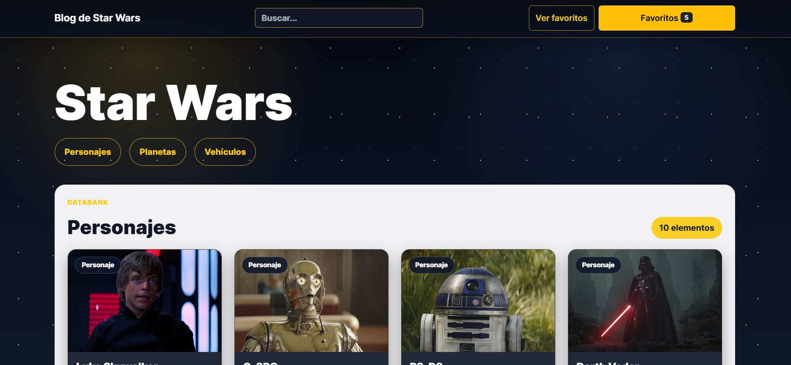
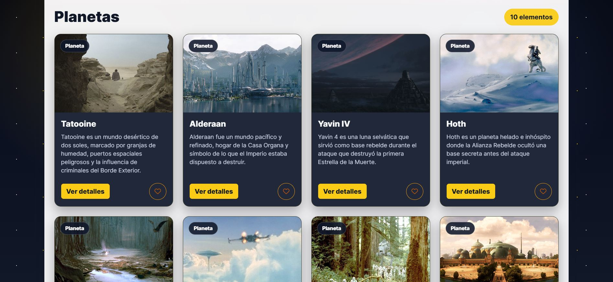
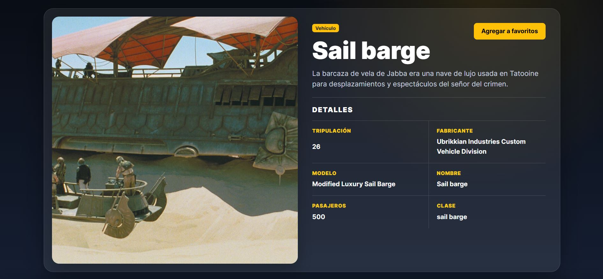

# StarWars Blog API and Reading List

Full-stack Star Wars blog project with a Flask REST API, SQLAlchemy models, Flask Admin, database migrations, and a React/Vite reading-list frontend.

The app lets users browse people, planets, and vehicles, open detail pages, and add or remove favorites. Authentication is intentionally not implemented yet, so the API uses a fixed current user (`CURRENT_USER_ID = 1`) and users can be managed from Flask Admin.

## Tech Stack

- Backend: Python, Flask, Flask-SQLAlchemy, Flask-Migrate, Flask-Admin, PostgreSQL/SQLite
- Frontend: React, Vite, React Router, Bootstrap, CSS
- Tooling: Pipenv, npm, ESLint, pycodestyle, Alembic migrations

## Project Structure

```text
src/                         Flask API source code
migrations/                  Alembic migration files
frontend/                    React/Vite frontend
```

## Backend Features

- `GET /people`
- `GET /people/<id>`
- `POST /people`
- `PUT /people/<id>`
- `DELETE /people/<id>`
- `GET /planets`
- `GET /planets/<id>`
- `POST /planets`
- `PUT /planets/<id>`
- `DELETE /planets/<id>`
- `GET /vehicles`
- `GET /vehicles/<id>`
- `POST /vehicles`
- `PUT /vehicles/<id>`
- `DELETE /vehicles/<id>`
- `GET /users`
- `GET /users/favorites`
- `POST /favorite/people/<id>`
- `POST /favorite/planet/<id>`
- `POST /favorite/vehicle/<id>`
- `DELETE /favorite/people/<id>`
- `DELETE /favorite/planet/<id>`
- `DELETE /favorite/vehicle/<id>`

Favorites are protected with a database check constraint so a favorite row can point to exactly one entity type: person, planet, or vehicle.

## Frontend Features

- Responsive catalog for people, planets, and vehicles
- Detail pages for every resource type
- Favorite add/remove actions connected to the Flask API
- Favorites dropdown in the navbar
- Search across people, planets, and vehicles
- Image fallback system using local images, mapped official images, and Star Wars Visual Guide
- Deploy-ready API base URL through `VITE_API_URL`

## Installation

Install backend dependencies:

```bash
pipenv install
```

Install frontend dependencies:

```bash
cd frontend
npm install
```

No extra downloads are needed if those dependencies are already installed in the workspace.

## Environment

Backend uses `DATABASE_URL` when available. If it is not set, it falls back to SQLite at `/tmp/test.db`.

Frontend can use the Vite proxy locally or a deployed API URL:

```bash
cd frontend
cp .env.example .env
```

Example frontend variable:

```bash
VITE_API_URL=http://localhost:3000
```

For local development with the included Vite proxy, `VITE_API_URL` can also be left empty.

## Run Locally

Prepare the database and seed sample Star Wars data:

```bash
pipenv run flask --app src/app.py db upgrade
pipenv run flask --app src/app.py seed
```

Start the backend:

```bash
pipenv run start
```

Backend URL:

```text
http://localhost:3000
```

Start the frontend in another terminal:

```bash
cd frontend
npm run dev
```

Frontend URL:

```text
http://localhost:5173
```

## Quality Checks

Backend:

```bash
python -m py_compile src/app.py src/models.py src/admin.py src/utils.py src/wsgi.py
pipenv run pycodestyle --config=pycodestyle.cfg src migrations/versions
```

Frontend:

```bash
cd frontend
npm run lint
npm run build
```

## Admin

Flask Admin is available at:

```text
http://localhost:3000/admin
```

Because authentication is not implemented yet, users should be created directly from Flask Admin or seeded through the database.

## Screenshots




